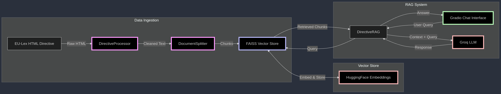

# EU Directive Chat Assistant

A RAG-powered chatbot that helps you understand EU directives. Ask questions in plain English and get accurate answers based on the directive content.

## Current Implementation

This prototype focuses on the Directive (EU) 2018/1972, which establishes the European Electronic Communications Code. The system can be extended to handle other directives as well.

## Architecture

The system consists of several components working together:


## Data Processing Pipeline:

- DirectiveProcessor: Cleans and structures the HTML content
- DocumentSplitter: Breaks down the text while preserving the document hierarchy
- FAISS Vector Store + Embeddings: Powers the semantic search

## Chat Interface:

- Gradio web UI for easy interaction
- RAG system using Groq LLM for accurate responses
- Proper source citations from the directive

## How to Run

1. Clone the repository
2. Install the requirements using poetry (preferably in a virtual environment):

```bash
poetry install
```

3. Set up GROQ API key (copy `.env.dist` to `.env` and fill in the API key)
4. Run the app:

```bash
poetry run python main.py
```

## Troubleshoting

- At first run, the system will download the necessary models and embed the directive content. This may take a while.
- Currently the Groq model is set to: `llama3-70b-8192` which has limited free usage (token-wise). It may happen that the context is too large for the free tier limit.
